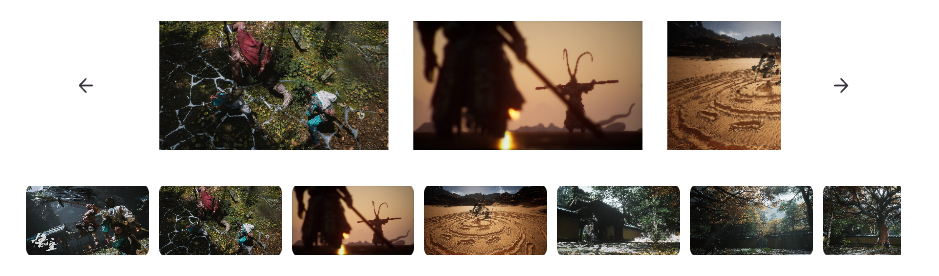

# Obsidian Carousel

Create a carousel component by code block. You can customize some of the configuration of the carousel image.


## Usage

This plugin is implemented base on top of [Embla Carousel](https://github.com/davidjerleke/embla-carousel). The configuration provided below is also implemented with reference to the [examples](https://www.embla-carousel.com/examples/predefined/) given by Embla Carousel.

> The configuration name is case insensitive.

|     config     |             value              | explain                                                                                                                                                  |
| :------------: | :----------------------------: | -------------------------------------------------------------------------------------------------------------------------------------------------------- |
|     folder     |     path/to/images/folder      | Used to locate pictures. Can be used with config 『images』. You can have multiple 『folder』.                                                           |
|     images     | path/to/image1, path/to/image2 | The path is an absolute path. Paths to different images are separated by commas.                                                                         |
|     height     |             25rem              | Height of carousel component. Default is 25rem.                                                                                                          |
|      loop      |           true/false           | Images loop or not. Default is false.                                                                                                                    |
|   direction    |            ltr/rtl             | Left to right or right to left. Default is ltr.                                                                                                          |
|   SlidesSize   |       eg. 100%/50%/33.3%       | Size of each image. Default is 100%.                                                                                                                     |
| SlidesToScroll |        'auto' or number        | The number of images skipped per page turn. auto indicates that the value is automatically set. You can also set the number yourself. Default is 'auto'. |
|    dragfree    |           true/false           | Represents whether images are automatically adsorbed when you drag and drop them. Default is false.                                                      |
|     align      |        start/center/end        | The position where the image is adsorbed in the viewport. start indicates the adsorption on the left side. Default is center                             |
|      axis      |              x/y               | Represents the direction of the roll. Default is x.                                                                                                      |
|    autoplay    |           true/false           | When set to true, carousel will automatically **skip** to the next image every 3s. Default is false.                                                     |
|   autoscroll   |           true/false           | When set to true, carousel will automatically **scroll** to the next image every 3s. Default is false.                                                   |
|      fade      |           true/false           | When switching images, the switching style is changed from scroll to fade.                                                                               |
|  Arrowbutton   |           true/false           | You can hide arrow buttons by setting `Arrowbutton: false`. Default is true.                                                                             |

## Example

````
```carousel
folder: path/to/images/folder
images: p/t/i1, p/t/i2, p/t/i3
height: 30rem
loop: true
SlidesSize: 50%
dragfree: true
axis: x
autoplay: true
fade: false
```
````

````
```carousel
folder: images
height: 13rem
slidessize: 33.3%
align: start
loop: true
```
````


